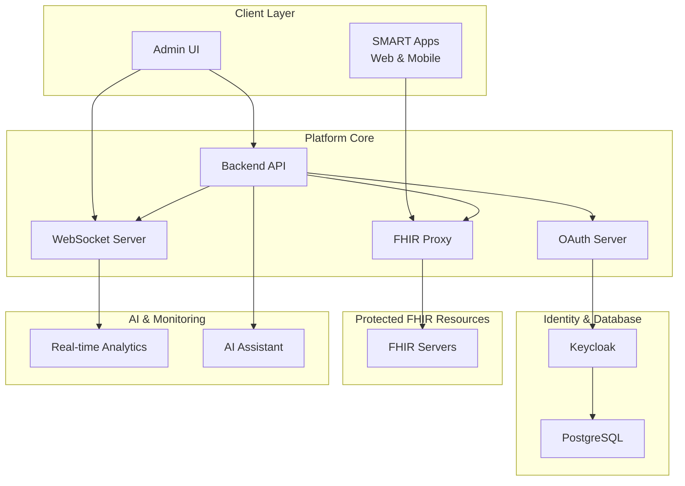

# SMART on FHIR Platform

A comprehensive healthcare application platform implementing the complete SMART App Launch Framework 2.2.0 specification with advanced administrative capabilities, AI-powered assistance, and enterprise-grade security.

[](https://github.com/quotentiroler/smart-on-fhir-proxy)
[](http://hl7.org/fhir/smart-app-launch/)
[](https://hl7.org/fhir/R4/)
[](https://nodejs.org/)
[](https://bun.sh/)

## 🏥 Overview

The SMART on FHIR Platform is a complete enterprise solution for managing healthcare applications, users, and FHIR servers in compliance with the SMART App Launch framework. It provides secure OAuth 2.0 flows, comprehensive user management, real-time monitoring, and an AI-powered administrative assistant.

### Key Features

- **🔐 Complete OAuth 2.0 & SMART Authorization**: Full implementation of SMART App Launch Framework 2.2.0
- **👥 Healthcare User Management**: Comprehensive lifecycle management with FHIR resource associations
- **🏥 Multi-FHIR Server Support**: Health monitoring, configuration, and proxy capabilities
- **📱 SMART App Registry**: Application registration with granular scope management
- **🎯 Dynamic Launch Context**: Clinical context injection and management
- **📊 Real-time OAuth Monitoring**: Live analytics with WebSocket-powered dashboards
- **🔑 Enterprise Identity Integration**: SAML 2.0 and OpenID Connect support
- **🤖 AI-Powered Administrative Assistant**: RAG-enabled intelligent support system
- **🚀 Automated CI/CD Pipeline**: Multi-branch versioning with GitHub Actions

## 🏗️ Architecture



### Technology Stack

- **Backend**: Node.js, TypeScript, Elysia, Bun
- **Frontend**: React, Vite, TypeScript, Tailwind CSS
- **Identity**: Keycloak with PostgreSQL
- **AI**: OpenAI GPT-4o-mini with RAG
- **Monitoring**: WebSocket, Real-time dashboards
- **Testing**: Jest, Playwright, Comprehensive test suites
- **Deployment**: Docker, GitHub Actions CI/CD

## 🚀 Quick Start

### Prerequisites

- Node.js ≥18.0.0
- Bun ≥1.0.0
- Docker & Docker Compose
- PostgreSQL (or use Docker)

### Installation

1. **Clone the repository**

   ```bash
   git clone https://github.com/quotentiroler/smart-on-fhir-proxy.git
   cd smart-on-fhir-proxy
   ```
2. **Start the development environment**

   ```bash
   # Start all services with Docker
   docker-compose up -d

   # Install dependencies
   bun install

   # Start development servers
   bun run dev
   ```
3. **Access the platform**

   - Admin UI: http://localhost:3000
   - Backend API: http://localhost:8080
   - Keycloak: http://localhost:8090
4. **Initial Configuration**

   - Log into the Admin UI with default credentials
   - Follow the [Getting Started Guide](docs/tutorials/getting-started.md)
   - Configure your first FHIR server and SMART app

## 📚 Documentation

### 🎯 Quick Links

- **[Getting Started](docs/tutorials/getting-started.md)** - Complete setup guide
- **[API Documentation](docs/api/)** - Comprehensive API reference
- **[SMART 2.2.0 Checklist](docs/SMART_2.2.0_CHECKLIST.md)** - Implementation progress
- **[Development Roadmap](ROADMAP.md)** - Feature roadmap and milestones

### 🛠️ Admin UI Documentation

- [Dashboard Overview](docs/admin-ui/dashboard.md) - System monitoring and health
- [User Management](docs/admin-ui/user-management.md) - Healthcare user administration
- [SMART Apps](docs/admin-ui/smart-apps.md) - Application registration and management
- [FHIR Servers](docs/admin-ui/fhir-servers.md) - Server configuration and monitoring
- [Scope Management](docs/admin-ui/scope-management.md) - Granular permission control

### 🔬 Technical Guides

- [OAuth 2.0 Flows](docs/smart-on-fhir/oauth-flows.md) - Authorization patterns
- [Launch Contexts](docs/smart-on-fhir/launch-contexts.md) - Clinical context management
- [Agent Scopes](docs/smart-on-fhir/agent-scopes.md) - Autonomous system authorization
- [Version Management](docs/VERSION_MANAGEMENT.md) - Release and versioning strategy

### 📖 Tutorials

- [Registering SMART Apps](docs/tutorials/smart-app-registration.md)
- [User Onboarding](docs/tutorials/user-onboarding.md)
- [FHIR Server Setup](docs/tutorials/fhir-server-setup.md)
- [OAuth Flow Testing](docs/tutorials/oauth-flow-testing.md)
- [Troubleshooting](docs/tutorials/troubleshooting.md)

## 🤖 AI Assistant

The platform includes an intelligent AI assistant powered by RAG (Retrieval Augmented Generation) technology:

### Capabilities

- **Navigation Guidance**: Help finding the right administrative sections
- **Configuration Assistance**: Step-by-step setup guidance
- **SMART on FHIR Expertise**: Deep knowledge of specifications and best practices
- **Troubleshooting Support**: Common issues and solutions
- **Real-time Documentation**: Always up-to-date with platform changes

### Example Queries

```
"How do I register a new SMART app?"
"What scopes do I need for patient data access?"
"Show me the OAuth monitoring dashboard"
"How do I configure launch contexts for my app?"
"What are the security best practices?"
```

## 🛠️ Development

### Project Structure

```
smart-on-fhir-proxy/
├── backend/          # Node.js backend API
├── ui/               # React admin interface
├── test/             # Comprehensive test suites
├── keycloak/         # Identity provider configuration
├── docs/             # Complete documentation
├── .github/          # CI/CD workflows
└── scripts/          # Development and deployment scripts
```

### Development Commands

```bash
# Development
bun run dev              # Start all development servers
bun run dev:backend      # Backend only
bun run dev:ui           # Frontend only

# Building
bun run build            # Build all projects
bun run build:backend    # Build backend
bun run build:ui         # Build frontend

# Testing
bun run test                    # Run all tests
bun run test:smart-flows        # SMART App Launch tests
bun run test:backend-services   # Backend API tests

# API Generation
bun run generate                # Generate API clients
bun run validate-api            # Validate OpenAPI specs

# Version Management
bun run version:sync            # Sync all package.json versions
bun run version:bump patch      # Bump patch version
```

### Branching Strategy

- **`main`**: Production releases (auto-tagged)
- **`test`**: Beta releases with `-beta` suffix
- **`develop`**: Alpha releases with `-alpha` suffix
- **`dev/*`**: Feature branches

Each branch automatically triggers appropriate CI/CD workflows with version management.

## 📋 Development Status

### ✅ Completed Features

- Core infrastructure and architecture
- Multi-branch CI/CD pipeline with automated versioning
- Keycloak integration and OAuth2 flows
- Administrative API with generated clients
- Docker containerization and development environment
- Comprehensive documentation structure
- AI assistant integration framework

### 🚧 In Progress (v0.0.2-v0.0.8)

- SMART App Launch 2.2.0 specification implementation
- Discovery endpoints and capability advertisement
- EHR and Standalone launch flows
- Enhanced OAuth2 security patterns
- Real-time monitoring dashboards

### 📅 Roadmap Highlights

| Version          | Milestone              | Target Features                           |
| ---------------- | ---------------------- | ----------------------------------------- |
| **v0.0.8** | SMART 2.2.0 Compliance | Complete specification implementation     |
| **v0.9.x** | AI Enhancement         | Advanced monitoring, predictive analytics |
| **v1.0.0** | Production Ready       | Enterprise deployment, full documentation |

**[📖 View Complete Roadmap](ROADMAP.md)**

## 🔒 Security

### OAuth 2.0 Security Features

- PKCE (Proof Key for Code Exchange) support
- JWT token validation and introspection
- Scope-based access control
- Refresh token rotation
- Rate limiting and brute force protection

### Enterprise Security

- SAML 2.0 and OpenID Connect integration
- Multi-factor authentication support
- Audit logging and compliance tracking
- TLS/SSL encryption for all communications
- Role-based access control (RBAC)

### SMART on FHIR Compliance

- Patient context security
- Launch context validation
- Scope verification and enforcement
- Backend services authentication
- Agent-based authorization patterns

## 🧪 Testing

The platform includes comprehensive testing across all layers:

### Test Categories

- **Unit Tests**: Core logic and utilities
- **Integration Tests**: API endpoints and flows
- **SMART Flow Tests**: Complete authorization workflows
- **Security Tests**: OAuth vulnerabilities and compliance
- **End-to-End Tests**: Full user journey validation

### Running Tests

```bash
# All tests
bun run test

# Specific test suites
bun run test:smart-flows        # SMART App Launch workflows
bun run test:backend-services   # Backend API integration
bun run test:oauth-security     # Security validation
```

## 📈 Monitoring & Analytics

### Real-time Dashboards

- OAuth flow monitoring and analytics
- FHIR server health and performance
- User activity and access patterns
- Application usage statistics
- System performance metrics

### WebSocket Integration

- Live event streaming
- Real-time notifications
- Interactive dashboards
- Immediate alert systems

## 🤝 Contributing

We welcome contributions! Please see our contributing guidelines and:

1. Fork the repository
2. Create a feature branch (`dev/feature-name`)
3. Make your changes with tests
4. Submit a pull request to `develop`

### Development Guidelines

- Follow TypeScript and React best practices
- Include comprehensive tests for new features
- Update documentation for API changes
- Ensure SMART on FHIR compliance

## 📄 License

This project is licensed under the MIT License - see the [LICENSE](LICENSE) file for details.

## 🆘 Support

### Getting Help

- **AI Assistant**: Use the built-in AI assistant for immediate help
- **Documentation**: Check our comprehensive [documentation](docs/)
- **Issues**: Report bugs and request features on GitHub
- **Discussions**: Join community discussions

### Professional Support

For enterprise deployments and professional support, please contact our team.

## 🔗 Related Projects

- [SMART App Launch Framework](http://hl7.org/fhir/smart-app-launch/)
- [FHIR R4 Specification](https://hl7.org/fhir/R4/)
- [Keycloak](https://www.keycloak.org/)
- [OAuth 2.0 RFC](https://tools.ietf.org/html/rfc6749)

---

<div align="center">

**Built with ❤️ for the healthcare community**

[🏠 Home](https://github.com/quotentiroler/smart-on-fhir-proxy) • [📚 Documentation](docs/) • [🚀 Roadmap](ROADMAP.md) • [🐛 Issues](https://github.com/quotentiroler/smart-on-fhir-proxy/issues)

</div>
